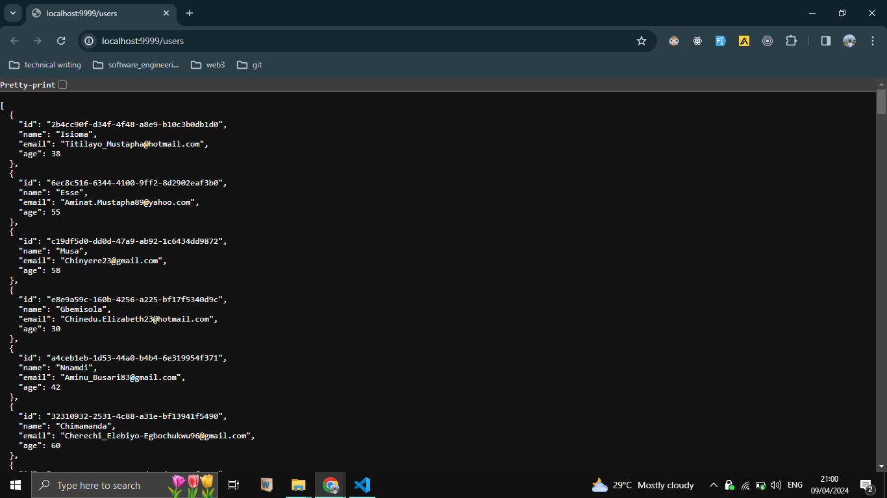

# This is a sample to elborate the mock-api creation process properly

## Steps

1. git clone this repository
2. run `npm install` to get "fs, json-schema-faker, @faker-js/faker & json-server" dependencies
3. write your schema
4. write your generator function
5. write the scripts to run the generator function and serve your generated data in a specified port

## Description

1. in order to clone this repo, enter the code below into your terminal

```sh
git clone https://github.com/Andreyhuey/mock-api.git
```

2. To install the needed dependencies, run the code below in your terminal

```sh
npm install json-server json-schema-faker
```

```sh
npm install --save-dev @faker-js/faker fs jest
```

3. write your schema,
   In this case we are going to write the schema for a user object containing

i) navigate to the `src/schema` folder, several other sample schemas are provided in the folder
ii) locate the`userSchema.js` file


4. write your generator function which uses json-schema-faker to create the data from the imported schema provided


5. write the scripts provided below and run the `npm run start-users` to complete the mock-api


```sh
npm run start-users
```

## Results

Once the `npm run start-users` is started in the terminal you can start performing CRUD functionality and enjoy your mock-api



